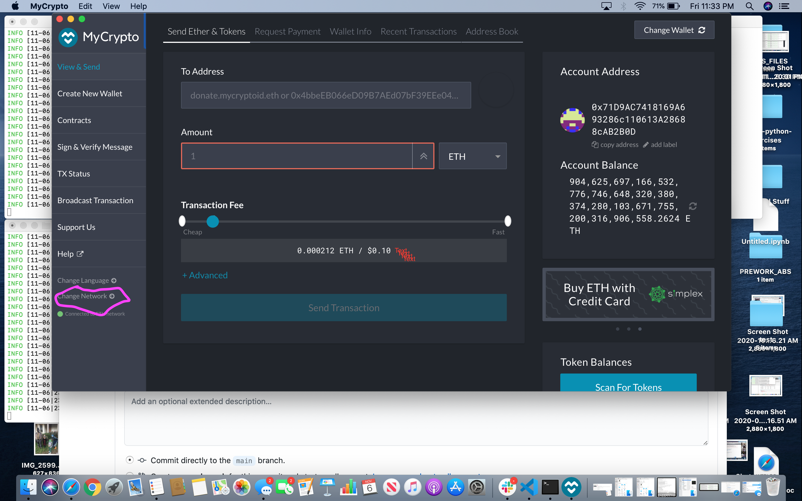
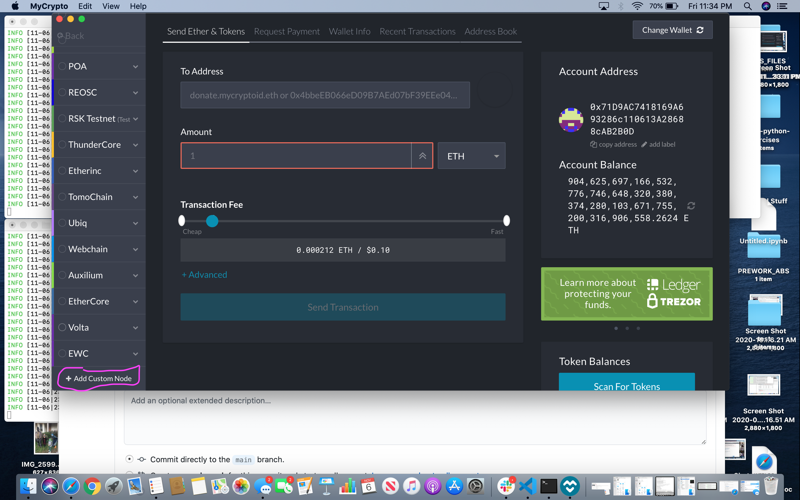
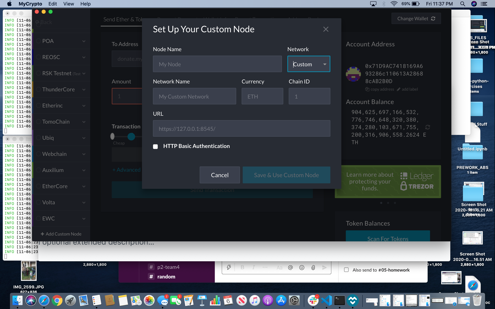
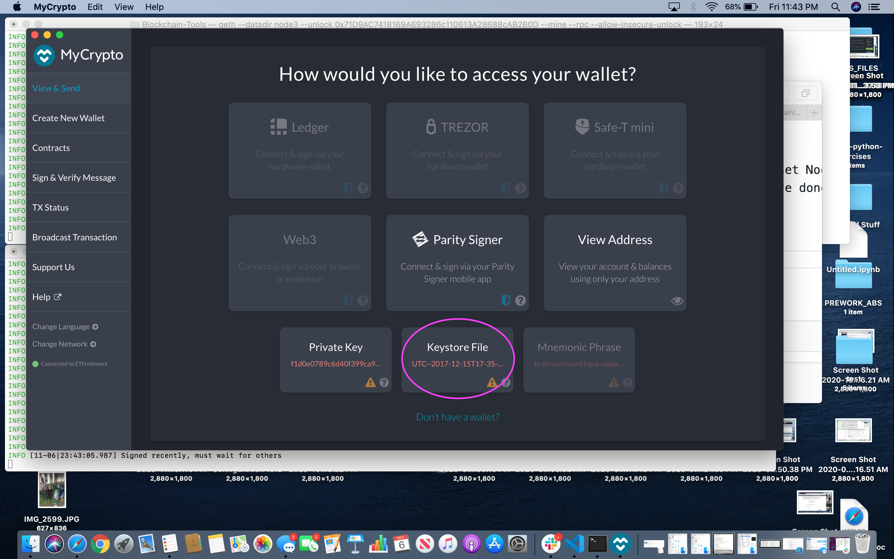
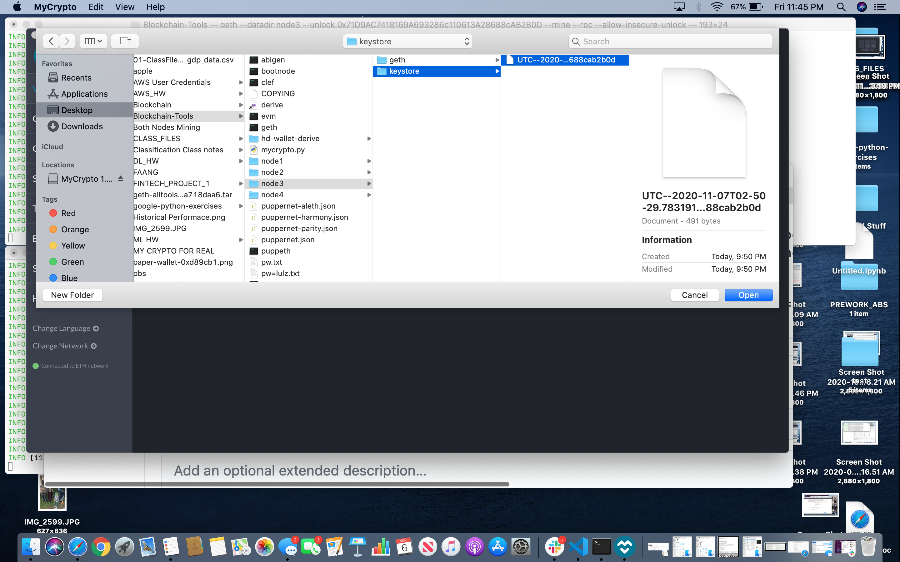
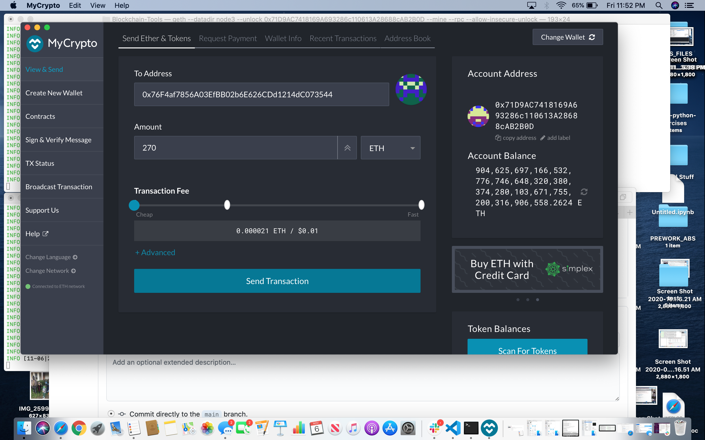

# zeeauthblockchain

Greeting Z Bank Employee! This document explains how you can send transactions on the bank's very own blockchain, zeeauthblockchain.

The first step in using the bank's blockchain is to use the terminal to navigate to the folder that contains geth, the program that runs the block chain. You can find terminal listed in the applications folder of the bank's computer. The terminal is a way of running programon the bank's computer. Once you've opened a new window in terminal enter the following commmands and press return.

cd desktop 

cd Blockchain-Tools

This will allow the following commands to be run in the Blockchain-Tools folder, which contains geth. The following line of code will start node3. (Node1 was used by the bank in another network, so the first node that you'll need to start is node3.)

./geth --datadir node3 --unlock "0x71D9AC7418169A693286c110613A28688cAB2B0D" --mine --rpc --allow-insecure-unlock

The first part of the code tells the terminal to run the command in geth. The datadir tells it to run the command in the node3 folder, and unlock and the long number unlock node3, which is identified with it's public code. --mine tells it to begin mining, --rpc allows the code to be run in a diffrent folder, and --allow-insecure-unlock allows it to begin to unlock before you enter the password. 

Once you've run that code the terminal shoud start to fill with information, and you need to enter your password at this point. The password for all of the banks accounts, public and private, is lulz. Be sure that you have capslock off, the program will only allow you three tries to enter the password.

Now it's time to unlock the second node, node4, and have it begin mining. Open a new window in terminal, you can select new window under shell in the top left of the screen or use command N. Enter the following code into the terminal.

./geth --datadir node4 --unlock "0x76F4af7856A03EfBB02b6E626CDd1214dC073544" --mine --port 30304 --bootnodes "enode://e90f83902d0fdf0e5ff073170d1b455e16208b011f290f7460f37a85ed9426938a104236762ef917bc4247e72f2545db396db99398469b8464a738bb210bc260@127.0.0.1:30303" --ipcdisable --allow-insecure-unlock

You need to enter the password lulz as you did before. Each node can have it's own password, but both were set to lulz because that's what banking is all about.

The first parts of the code are identical to the code above it, but there are many important differences. --port sets the port that the application will use to acceptt communciations, and the bootnode gives the address of where the first node is mining so that the second node can use it to look for other parts of the network. --ipcdisable disables the IPC and RPC servers, which limits the nodes ability to communicate outside of the network on this computer and others. 

Congradulations! These commands should have both nodes running and creating new crypto-currency for Zee Bank.

The network was configured using puppeth, another program found in the block chain tools finder. The blocktime, or the time the network is expected to take to create new ethereum. This generally takes between 10 and 19 seconds, so the bank set it to the default value of 15 seconds. The chain ID, a number used to differentiate chains from each other, was set to 123 because it's easy to remember. 

You can now use the MyCrypto Application to connect to the nodes in each network and send a transaction. You can find mycrypto in the applications folder using the finder. Once you have it open the first step is to create a network for the nodes to communicate with each other. Start by clicking on the change network button on the lower left of the main screen.

Then click on Create Custom Node, again on the lower left.

Change the Network Button on the upper right to custom and enter the following values. Set Node Name and Network Name to zeeauthblockchain, the cCurrency to ETH, the Chain ID TO 123, and the URL to https://127.0.0.1:8545. When you've done that click on save and use custom node, and you should be able to see that the network is running properly on the lower left of the main screen.

Now it's time to connect your Node to the Network you just made. Click on the Select Wallet File and naviagate to the Blockchain-Tools folder on the desktop, and then go to the Node3 folder and select the keystone file. Click on open, and add the same password as the bank uses for everything, lulz. You can access node4 the same way. 

Since you've connected the nodes, you can see if they are working by sending test ethereum from one node to the other. The address of the two nodes is below. Once you've entered the address of the other node select and amount and a speed, which sets the priority of recording the transaction and costs more the less time it will take the network to complete the transfer. Once you've clicked send a second screen will pop up and you can confirm the transaction.

Node 4's address: 0x76F4af7856A03EfBB02b6E626CDd1214dC073544
Node 3's address: 0x71D9AC7418169A693286c110613A28688cAB2B0D

You can then check the status of the transaction using the check status button, or the transaction history section on the right.
